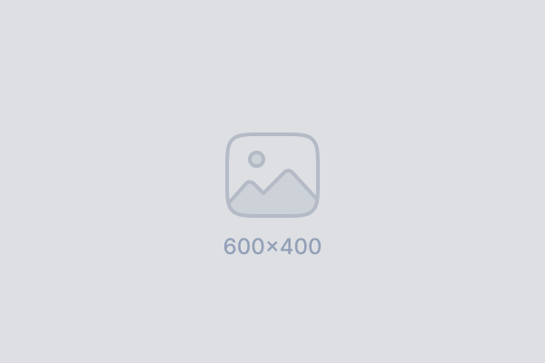
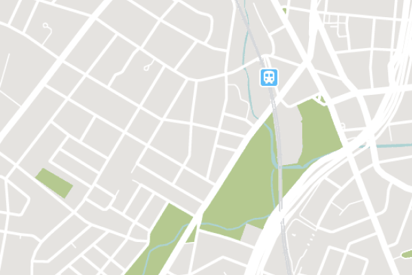

I've started keeping a folder of photographs the same way I keep a commonplace book — not curated, not captioned, just collected because something in the frame made me stop scrolling past it. %%remember to ask about licensing before publishing any of these wider%% Most of them are unremarkable on their own. ==Together they start to rhyme==.

## Two of the sketches

Two frames in particular keep coming back to me — see [[#Two of the sketches]].

> [!warning] This is a _non-collapsible_ callout
> Some content is displayed directly!

A note on looking twice: it isn't so different from [[The habit of underlining]] — the image doesn't change, but what you're prepared to notice in it does.
